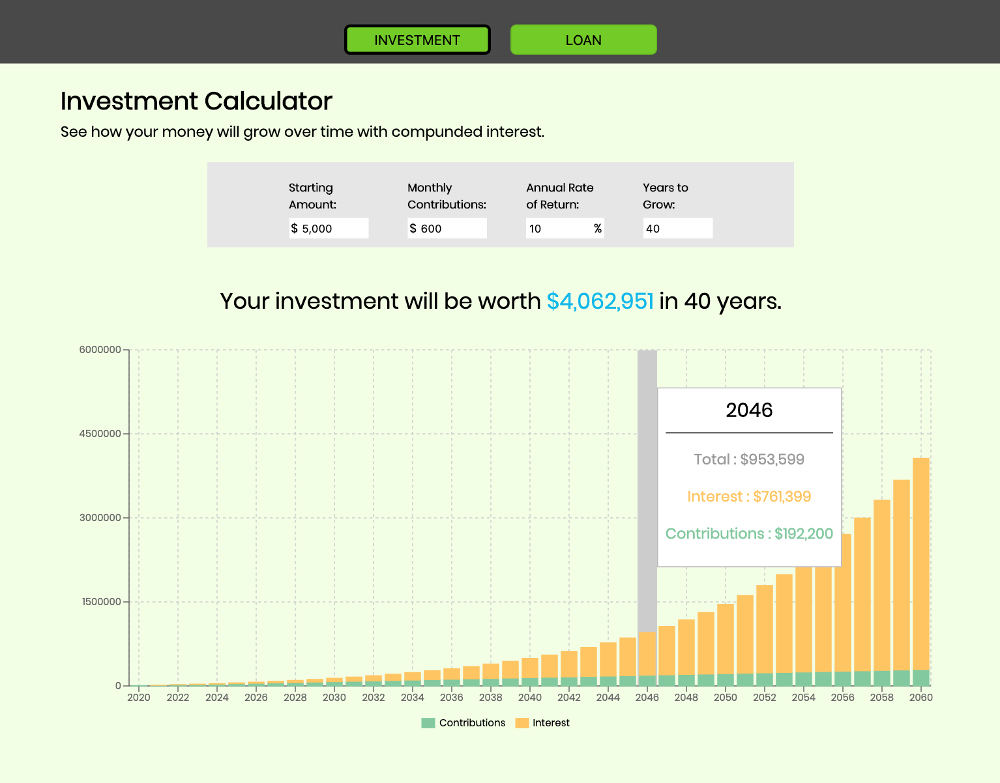
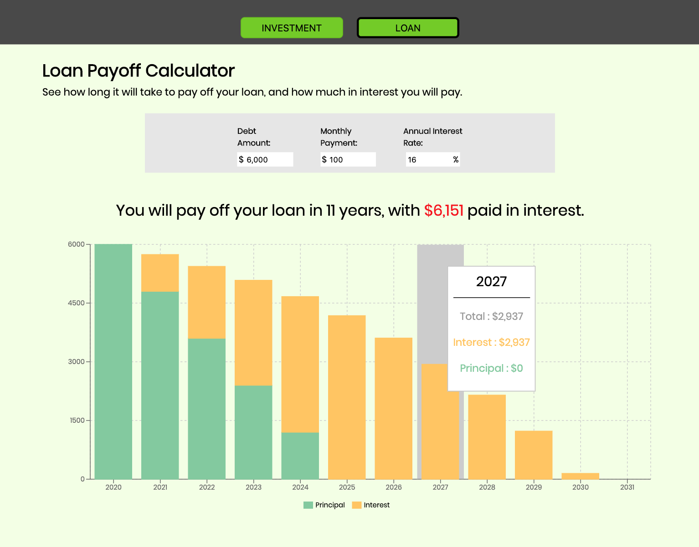

# Investment/Debt Visualizer App Using React

> A react web application that takes in a set of parameters (i.e. interest, contributions, time) and then calculates data to populate a barchart to help user visualize how their money will grow over time.

## Quick Start

```
# Install dependencies
npm install

# Serve on localhost:3000
npm start

# Build for production
npm run build
```

## Motivation

I think compound interest is very powerful and some people fail to see the magic of compound interest. I wanted to build an application to help people visually see how money can grow when reinvested and allowing adequate time for it to grow. And similarly, how quick debt can grow when not taken care of responsibly.

While building this I learned all about state and props. Passing props, passing functions, updating state, and more. I came across a concept called "prop drilling". Which is when you pass the state of a component down a large tree of components just to get to where it needs to go. I am guilty of this, so in my next projects I plan to find a solution to help me manage a global state, such as Redux.

I found a very nice charting library, [Recharts](https://recharts.org/en-US/), that I leveraged to build the responsive charts after building the dataset with the user given parameters.

## Screenshots

#### Investment Chart



#### Debt Payoff Chart



## App Info

#### Author: [Jaime Lovera](https://github.com/jaimelovera)
